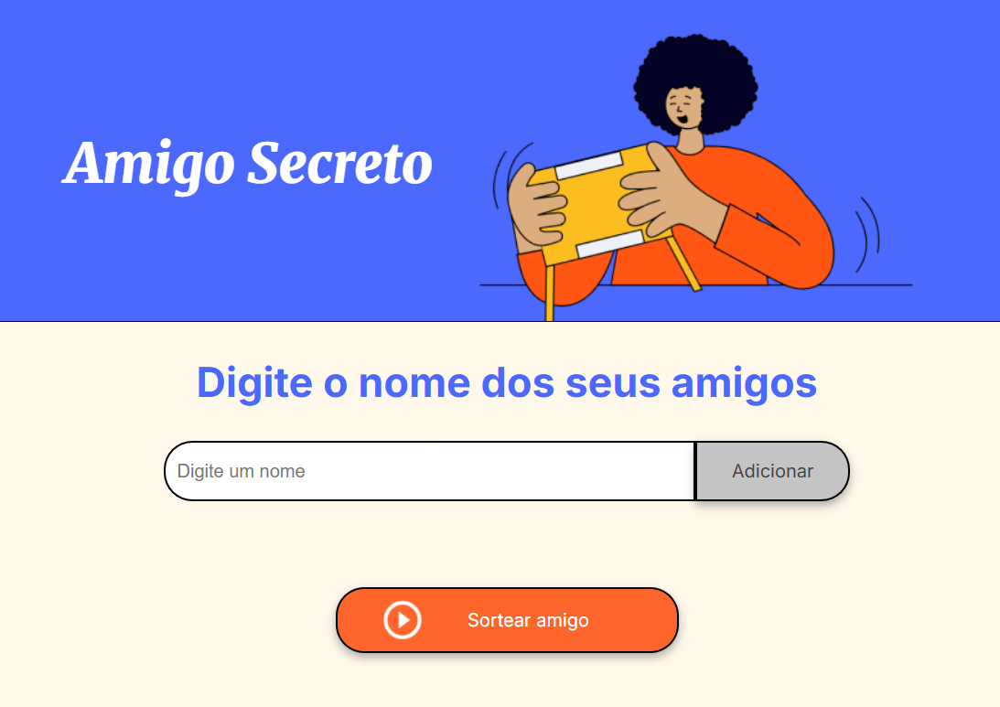

# 🎁 Amigo Secreto - Sorteio Online

Bem-vindo ao **Amigo Secreto - Sorteio Online**! Este é um aplicativo simples e interativo para organizar um sorteio de amigo secreto de maneira prática e divertida. Basta adicionar os nomes dos participantes e sortear um amigo aleatoriamente! 🎉

---

## 🚀 Funcionalidades

✅ Adicione quantos amigos quiser à lista.  
✅ Visualize os participantes já adicionados.  
✅ Realize o sorteio de forma aleatória e justa.  
✅ Interface amigável e intuitiva.  

---

## 🛠️ Tecnologias Utilizadas

O projeto foi desenvolvido utilizando:

- **HTML5** → Estrutura da aplicação.
- **CSS3** → Estilização e layout.
- **JavaScript (ES6+)** → Lógica do sorteio e manipulação da DOM.

---

## 📂 Estrutura do Projeto

```
📂 amigo-secreto/
│-- 📄 index.html      # Página principal
│-- 📄 style.css       # Estilos do projeto
│-- 📄 app.js          # Lógica do sorteio
│-- 📂 assets/        # Imagens e ícones
```

---

## 🎲 Como Usar

1️⃣ Abra o arquivo `index.html` em seu navegador.  
2️⃣ Digite o nome de um amigo e clique em **Adicionar**.  
3️⃣ Repita o processo até inserir todos os participantes.  
4️⃣ Clique em **Sortear amigo** para descobrir quem foi o sorteado! 🎉  

---

## 📷 Captura de Tela

  
*Exemplo da interface do sorteio de amigo secreto.*

---

## 🏗️ Como Executar Localmente

1. Clone este repositório:
   ```sh
   git clone https://github.com/Leylane/amigo-secreto.git
   ```
2. Acesse a pasta do projeto:
   ```sh
   cd amigo-secreto
   ```
3. Abra o `index.html` em seu navegador preferido.

---


Feito com ❤️ por [Leylane](https://github.com/Leylane) 😊

